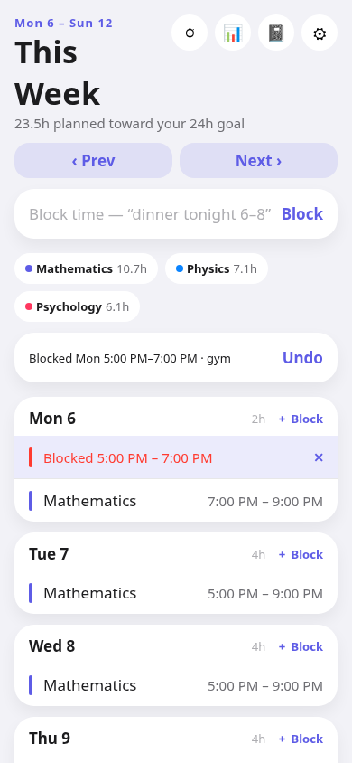
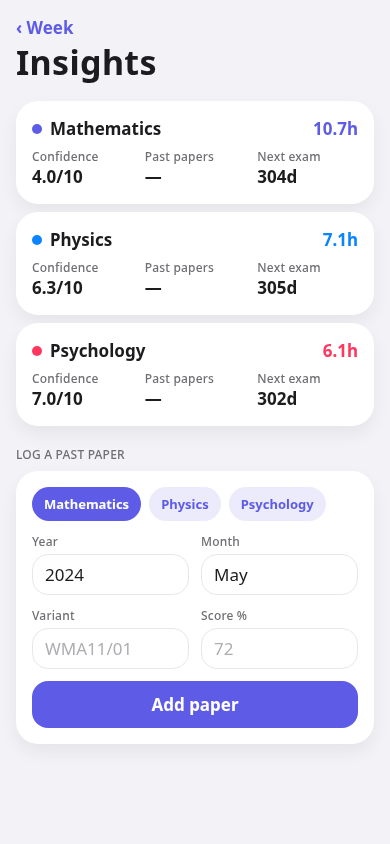
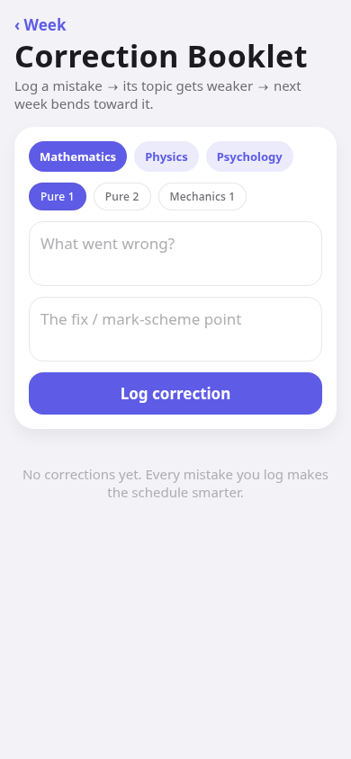
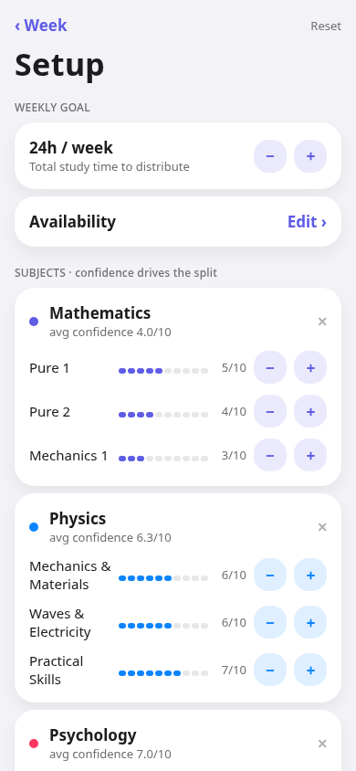
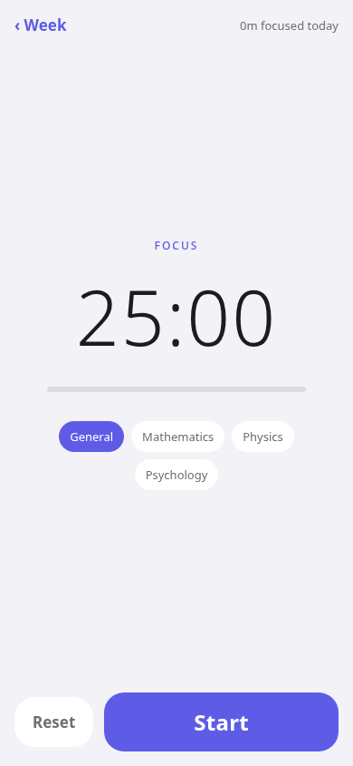

# Reflow

A personal study scheduler whose brain **derives** how many hours each subject gets this week — from days-to-exam, topic confidence, and past-paper performance — then **reflows** those hours around your fixed commitments and ad-hoc life ("dinner tonight 6–8"), keeping your weekly budget met. Built for Edexcel/Cambridge IAL.

Expo SDK 54 (React Native) · offline-first · MiniMax-powered (swappable) · self-hosted Supabase.

## Screens (verified rendering, headless browser)

| This Week (with reflow) | Insights | Correction Booklet |
|---|---|---|
|  |  |  |

| Setup | Focus Timer |
|---|---|
|  |  |

The This Week shot shows the core feature live: typing *"monday 5-7 gym"* blocked that slot and the week reflowed around it (Undo offered), keeping the weekly budget.

## Run

```bash
npm install
npm test              # vitest — engine + state (48 tests)
npm run typecheck     # tsc --noEmit
npx expo start        # run on device/simulator (Expo Go or dev build)
npx expo export -p web  # bundle check
```

## Architecture

- **`src/engine/`** — pure, zero-I/O TypeScript scheduling engine (runs on-device *and* server-side for Siri):
  - `intervals` free-window math · `allocator/` derives per-subject hours (`weighting.ts` = the tunable heuristic) · `placer/` slot-aligned, anchor-safe placement · `week.ts` `planWeek` + `reflow` (add/remove diff for undo). Fully unit-tested & adversarially hardened.
- **`src/state/`** — pure reducers (`model.ts`) + persistent store (`store.ts`, zustand + AsyncStorage). The closed loop: metrics (confidence, past-paper scores, focus) → allocator → schedule.
- **`src/lib/`** — `buildWeek` (subjects + IAL timetable → engine input), `parseBlock` (deterministic NL → block), `blockEntry` (local-first, MiniMax fallback), `pomodoro`, `llm` (proxy client).
- **`app/`** — expo-router screens: This Week · Setup · Correction Booklet · Insights · Timer.
- **`src/theme/` + `src/components/Surface.tsx`** — iOS-26 design system; `Surface` is the single Liquid-Glass swap point (SDK 56).
- **`supabase/functions/llm/`** — the swappable MiniMax proxy (deploy when the box is up).

## Status

| Phase | State |
|---|---|
| Engine | ✅ complete, hardened, tested |
| 1 — brain → UI (NL blocks, persistence, setup) | ✅ |
| 2 — weakness loop (topics + Correction Booklet) | ✅ |
| 3 — trackers + performance signal + Insights | ✅ |
| 4 — focus/pomodoro timer + metrics | ✅ (AI quizzes/Feynman: code ready, needs MiniMax key) |
| 0 — infra (box Supabase sync, deploy `/llm`) | ⏳ needs box SSH + MiniMax key |
| 5 — library, NotebookLM, Liquid Glass | ⏳ needs box Storage / `notebooklm-py` / SDK 56 + Mac |
| 6 — Siri App Intents | ⏳ needs Mac/AltStore signing |
| KB — IAL RAG grounding | ⏳ needs official source PDFs |

## Backend — `/llm` proxy (deployed)

The AI proxy is **live on the box**: a tiny Node service (`server/llm/`) holding the MiniMax key, running as container `reflow-llm` on the Caddy network, routed at `https://104-208-72-98.sslip.io/llm` (real Let's Encrypt cert, valid on iOS). Model: `MiniMax-M2` (reasoning model; the proxy strips `<think>` blocks). The app reads `EXPO_PUBLIC_LLM_URL` (see `.env.example`); unset ⇒ fully offline.

Verify from a real network (your laptop/phone — the endpoint isn't reachable from every host):
```bash
curl https://104-208-72-98.sslip.io/llm   # -> {"ok":true,"model":"MiniMax-M2"}
```

⚠️ The endpoint is currently **unauthenticated** — fine for personal use, but add a shared-secret header before making it public (it spends the MiniMax key). Redeploy after code changes: `scp server/llm/server.js` to `~/reflow-llm/` on the box, then `cd ~/reflow-llm && sudo docker compose up -d --build`.

## To unblock the rest
1. **Box**: `ssh -i ~/OpenClaw_key.pem senul@100.86.148.112 -p 2222` → confirm self-hosted Supabase → apply schema + Storage bucket → `supabase functions deploy llm` → set `MINIMAX_API_KEY` (+ verify `MINIMAX_BASE_URL`/`MODEL`) → set `EXPO_PUBLIC_LLM_URL` in the app.
2. **KB**: drop the official IAL specs / mark schemes / examiner reports / booklets somewhere the ingestion pipeline can read them.
3. **Device/native**: a Mac (or AltStore pipeline) for the dev build, Siri App Intents, and the SDK 56 Liquid Glass bump.
